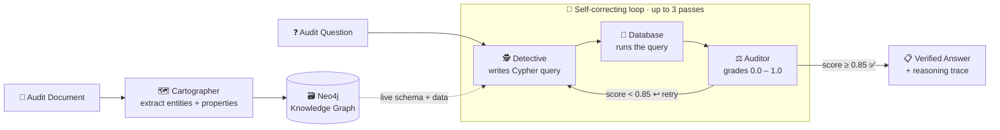

<div align="center">

# 🛡️ Sentinel-Graph Enterprise Core

### Autonomous Agentic Graph-RAG for High-Stakes Financial Audits

*Three AI specialists read your documents, build a knowledge graph, and answer audit questions — with a self-correcting loop that grades its own work.*

<br/>

[](https://sentinel-graph-auditor.streamlit.app)

<br/>

[](https://www.python.org/)
[](https://www.anthropic.com/claude)
[](https://neo4j.com/)
[](https://langchain-ai.github.io/langgraph/)
[](https://ai.pydantic.dev/)
[](https://streamlit.io/)
[](https://sentinel-graph-auditor.streamlit.app)

</div>

---

## 📌 Overview

**Sentinel-Graph** is a multi-agent system for investigating corporate fraud and contract discrepancies. It ingests unstructured audit documents, turns them into a queryable **knowledge graph**, and answers natural-language questions through a team of cooperating AI agents that **check and correct their own work**.

Ask it *"Which shell companies is the CEO connected to through contracts?"* and it writes the database query, runs it, grades the result, retries if needed, and hands back a verified, ranked answer — with the full reasoning shown step by step.

> **🚀 Try it now → [sentinel-graph-auditor.streamlit.app](https://sentinel-graph-auditor.streamlit.app)**
> Click **⚡ Seed sample fraud dataset**, pick a sample question, then **▶ Run Audit Trace**.

---

## ✨ Highlights

- **🤝 Multi-agent collaboration** — four specialists (Cartographer, Detective, Auditor, Orchestrator) hand work to each other through a LangGraph state machine.
- **🔁 Self-correcting (Self-RAG) loop** — the Auditor grades every answer `0.0–1.0`; anything below **0.85** is sent back for a smarter retry (up to 3 times).
- **🧠 Schema-grounded queries** — the Detective reads the *live* graph schema before writing Cypher, so it queries real properties instead of hallucinating.
- **📊 Fact-grounded answers** — risk scores, jurisdictions, and contract values are read straight from stored node properties, never invented.
- **🔍 Transparent reasoning** — the dashboard shows exactly what each agent did, in plain language, for human-in-the-loop verification.
- **☁️ Cloud-ready** — runs locally or deploys to Streamlit Cloud + Neo4j Aura with zero code changes.

---

## 🏗️ How It Works



### The Four Specialists

| Agent | File | Role |
|-------|------|------|
| 🗺️ **The Cartographer** | [`agents/cartographer.py`](agents/cartographer.py) | Reads raw documents and extracts **People, Companies, and Contracts** — with their properties (risk scores, jurisdictions, contract values) — then writes them into Neo4j as a graph. |
| 🕵️ **The Detective** | [`agents/detective.py`](agents/detective.py) | Translates plain-English questions into **Neo4j Cypher queries**, grounded against the live database schema to stay accurate. |
| ⚖️ **The Auditor** | [`agents/auditor.py`](agents/auditor.py) | Grades whether the results actually answer the question. A correct answer passes; a weak one triggers a **rewritten question and a retry**. |
| 🧭 **The Orchestrator** | [`agents/orchestrator.py`](agents/orchestrator.py) | The LangGraph **state machine** that wires the loop together, tracks the best result across attempts, and compiles the final reasoning trace. |

---

## 🧰 Tech Stack

| Layer | Technology |
|-------|-----------|
| **Orchestration** | [LangGraph](https://langchain-ai.github.io/langgraph/) — cyclical, stateful agent workflows |
| **Agent Framework** | [Pydantic-AI v1.x](https://ai.pydantic.dev/) — strict, typed JSON outputs from every agent |
| **Reasoning Model** | [Anthropic Claude Haiku 4.5](https://www.anthropic.com/claude) — fast, low-latency multi-hop reasoning |
| **Knowledge Graph** | [Neo4j](https://neo4j.com/) (local or [Aura](https://neo4j.com/cloud/aura/) cloud) — nodes, relationships, multi-hop Cypher |
| **Interface** | [Streamlit](https://streamlit.io/) — live, interactive reasoning-trace dashboard |

---

## 🚀 Quickstart (Local)

**Prerequisites:** Python 3.11+, a running Neo4j instance, and an [Anthropic API key](https://console.anthropic.com/).

```bash
# 1. Clone
git clone https://github.com/pritmon/Sentinel-Graph-Enterprise-Core.git
cd Sentinel-Graph-Enterprise-Core

# 2. Create an isolated environment
python3 -m venv venv
source venv/bin/activate
pip install -r requirements.txt

# 3. (Optional) Start Neo4j locally with Docker
docker run -d --name sentinel-neo4j -p 7474:7474 -p 7687:7687 \
  -e NEO4J_AUTH=neo4j/password neo4j:5

# 4. Launch the dashboard
streamlit run src/dashboard.py
```

Then open **http://localhost:8501**, click **⚡ Seed sample fraud dataset**, and run a question.

### 🔑 Configuration

Create a `.env` file in the project root (see [`.env.example`](.env.example)):

```env
# Reasoning model — a Pydantic-AI "provider:model" string
LLM_MODEL="anthropic:claude-haiku-4-5"
ANTHROPIC_API_KEY="sk-ant-..."

# Neo4j connection
NEO4J_URI="bolt://localhost:7687"
NEO4J_USERNAME="neo4j"
NEO4J_PASSWORD="password"
```

> 💡 `LLM_MODEL` accepts **any** Pydantic-AI `provider:model` string, so you can swap models without touching code (e.g. `anthropic:claude-sonnet-4-6`).

---

## ☁️ Deploy a Public App

Host it for free on **Streamlit Community Cloud** backed by **Neo4j Aura**. Full step-by-step guide: **[DEPLOY.md](DEPLOY.md)**.

In short: create a free Aura database → deploy `src/dashboard.py` on [share.streamlit.io](https://share.streamlit.io) (Python 3.11) → paste your secrets. The live demo above runs exactly this setup.

---

## 🧪 Testing

```bash
# Orchestrator logic — 100-run stress test (no database needed)
python test_100.py

# Full system — DB connectivity + agents (needs a live Neo4j)
python -m unittest test_system

# End-to-end with the real model + database
python run_live_test.py
```

---

## 📂 Project Structure

<pre>
<a href="https://github.com/pritmon/Sentinel-Graph-Enterprise-Core">Sentinel-Graph-Enterprise-Core/</a>
├── <a href="agents">agents/</a>
│   ├── <a href="agents/cartographer.py">cartographer.py</a>     # 🗺️ Specialist A — document → graph
│   ├── <a href="agents/detective.py">detective.py</a>        # 🕵️ Specialist B — question → Cypher
│   ├── <a href="agents/auditor.py">auditor.py</a>          # ⚖️ Specialist C — grade &amp; self-correct
│   └── <a href="agents/orchestrator.py">orchestrator.py</a>     # 🧭 LangGraph workflow tying it together
├── <a href="src">src/</a>
│   ├── <a href="src/utils.py">utils.py</a>            # Safe, parameterized Neo4j helpers
│   └── <a href="src/dashboard.py">dashboard.py</a>        # 🖥️ Streamlit UI &amp; reasoning-trace viewer
├── <a href=".streamlit">.streamlit/</a>             # Theme + secrets template for cloud deploy
├── <a href="artifacts">artifacts/</a>              # Architecture notes &amp; engineering logs
├── <a href="test_system.py">test_system.py</a>          # Integration tests
├── <a href="test_100.py">test_100.py</a>             # Orchestrator stress test
├── <a href="run_live_test.py">run_live_test.py</a>        # End-to-end live demo script
├── <a href="requirements.txt">requirements.txt</a>        # Pinned dependencies
├── <a href="DEPLOY.md">DEPLOY.md</a>               # Public deployment guide
└── <a href="README.md">README.md</a>               # You are here
</pre>

---

<div align="center">

**Built with LangGraph · Pydantic-AI · Claude · Neo4j · Streamlit**

[🚀 Live Demo](https://sentinel-graph-auditor.streamlit.app) · [📦 Repository](https://github.com/pritmon/Sentinel-Graph-Enterprise-Core) · [☁️ Deploy Guide](DEPLOY.md)

</div>
