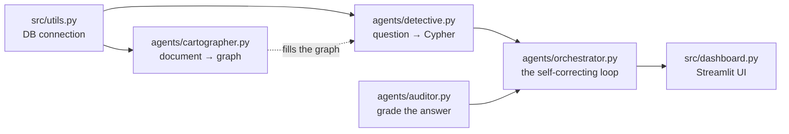

# 🧱 Architecture & Build Order

A developer's guide to *how this project is put together* — and the order you'd
create the files in if you were building it from scratch.

The guiding principle is simple:

> **Build bottom-up.** Start with the foundation, and never create a file before the
> thing it depends on exists. That way every step gives you something you can *run and
> verify* before you build the next layer on top of it.

---

## Dependency flow

Each arrow means *"needs the thing before it."*

```text
utils.py  →  cartographer.py  →  detective.py  →  auditor.py  →  orchestrator.py  →  dashboard.py
 (DB)         (write data)       (read data)      (grade)        (the loop)         (the UI)
```



---

## Phase 0 — Setup (before any real code)

| # | File | Why it comes here |
|---|------|-------------------|
| 1 | `requirements.txt` | You can't `import` a library you haven't installed. Pinning the toolset (LangGraph, Pydantic-AI, Neo4j, Streamlit) makes the environment reproducible from day one. |
| 2 | `.env` | The code needs secrets (database password, API key) to run. Define them once, in one place — never hardcode a key. |

---

## Phase 1 — The foundation

**3. `src/utils.py` — the database connection layer.**

This is the very first code because **everything** eventually talks to the database, and
it all goes through here (`get_neo4j_driver`, `execute_query`). If this doesn't work,
nothing else can. Build it and test it in isolation ("can I connect? can I run
`RETURN 1`?") before anything depends on it.

---

## Phase 2 — Get data *in* before you read it

**4. `agents/cartographer.py` — document → graph.**

You can't query an empty database. Before building the part that *reads* the graph, you
need a part that *fills* it. The Cartographer reads a document and writes nodes and
relationships using `utils.py`. After this file you can run it once and actually *see*
data appear in Neo4j.

---

## Phase 3 — Now read the data

**5. `agents/detective.py` — question → Cypher query.**

The graph now has data (from Phase 2), so you can build the part that answers questions
about it. It reads the live database schema (via `utils.py`) and writes a Cypher query.
Test it by asking a question and inspecting the query it produces.

---

## Phase 4 — Add the quality check

**6. `agents/auditor.py` — grade the answer.**

The simplest agent: it reads text and scores it `0.0–1.0`. It only makes sense once you
have a Detective answer *to* grade. It has no dependency on the other agents, so it could
come earlier — but logically you build it right before the loop that uses it.

---

## Phase 5 — Wire the workers together

**7. `agents/orchestrator.py` — the self-correcting loop.**

This is the **coordinator**, and it imports the Detective and the Auditor, so they must
exist first. It defines the LangGraph state machine:

```text
write query → run it → grade → (retry if score < 0.85, else finish)
```

This is the file that turns three separate workers into one intelligent system. You can
only build it once its pieces are ready.

---

## Phase 6 — The human-facing layer

**8. `src/dashboard.py` — the Streamlit UI.**

The UI is just a *window* onto everything beneath it. It imports the orchestrator and the
cartographer and puts buttons on them. There's no point building the window before the
house exists — so build it once the full pipeline works from the command line.

---

## Phase 7 — Lock in the behavior

| # | File | Why |
|---|------|-----|
| 9  | `test_100.py`    | Stress-tests the orchestrator's loop logic (mocked, no DB needed) so future edits can't silently break it. |
| 10 | `test_system.py` | Integration tests — real database connectivity plus the agents. |
| 11 | `run_live_test.py` | The end-to-end smoke test (real model + real DB): "does the whole thing actually work?" |

You write tests *after* something works, to **protect** that working behavior from future
changes.

---

## Phase 8 — Polish & ship (last)

| # | File | Why |
|---|------|-----|
| 12 | `.streamlit/` (theme + secrets template) | Deployment scaffolding — you only deploy something that already works locally. |
| 13 | `DEPLOY.md` | The public-deployment guide (Neo4j Aura + Streamlit Cloud). |
| 14 | `README.md` | Write/finish it last — you can only describe the project accurately once it exists. |

---

## One-sentence summary

> **Connection (`utils`) → fill the graph (`cartographer`) → read the graph (`detective`)
> → grade (`auditor`) → coordinate (`orchestrator`) → show it (`dashboard`) → test it →
> deploy it.**

Each step produces something you can run and verify before you build the thing that
depends on it — which is the whole secret to staying in control of a complex project.
