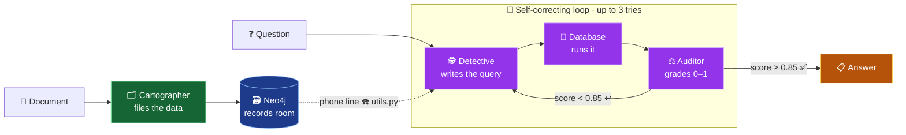

# 🎨 Architecture & Build Order — The Visual Guide

*How this project is layered, and the order to build (or read) the files — made easy to remember.*

---

> [!IMPORTANT]
> ## 🧠 One idea that unlocks everything: **You're opening a Detective Agency** 🕵️
> Every file is a member of staff. You **hire them in the order that lets each new person start working immediately** — you can't hire a detective before there's a case file to read, and you can't hire a receptionist before the agency does anything.

---

## ⚡ TL;DR — the whole project on one screen

| # | File | 🏢 Who they are | Their job | Why they're hired *now* |
|:-:|------|-----------------|-----------|--------------------------|
| 1️⃣ | `src/utils.py` | ☎️ **The phone line** | Connects to the records room (database) | Everyone uses it — set up the line *first* |
| 2️⃣ | `agents/cartographer.py` | 🗂️ **The Archivist** | Files documents into the records room | You need files *before* anyone can search them |
| 3️⃣ | `agents/detective.py` | 🕵️ **The Detective** | Searches the files to answer questions | Now there's something to search |
| 4️⃣ | `agents/auditor.py` | ⚖️ **The Supervisor** | Grades the detective's answer | Only makes sense once there's an answer to grade |
| 5️⃣ | `agents/orchestrator.py` | 🧭 **The Manager** | Coordinates the detective ⇄ supervisor loop | Needs both staff to exist first |
| 6️⃣ | `src/dashboard.py` | 🪟 **The Receptionist** | The front desk clients actually see | Only useful once the agency *works* |
| 7️⃣ | `test_*.py` | ✅ **The Inspector** | Locks in good behavior | Protect what works |
| 8️⃣ | `README` · `DEPLOY` | 📣 **The Sign on the door** | Tells the world | Last — describe it once it exists |

> [!TIP]
> **Say it out loud to remember the order:**
> ### ☎️ Connect → 🗂️ Collect → 🕵️ Question → ⚖️ Check → 🧭 Coordinate → 🪟 Show → ✅ Test → 📣 Ship

---

## 🗺️ The big picture (follow the colors)

🟦 **Blue = foundation** ·  🟩 **Green = write data in** ·  🟪 **Purple = read & reason** ·  🟧 **Amber = final answer**

---

## 🧩 Phase by phase

### 🟦 Phase 1 — The Foundation · `src/utils.py`
> [!NOTE]
> **Hook: "No phone line, no agency."** ☎️
> *Everything* talks to the database through this one file. Build and test it first (*"can I connect? can I run `RETURN 1`?"*). If this breaks, nothing else can even start.

### 🟩 Phase 2 — Fill the Graph · `agents/cartographer.py`
> [!TIP]
> **Hook: "You can't search an empty cabinet."** 🗂️
> Before building anything that *reads* the graph, build the thing that *fills* it. Run it once and you'll literally see nodes appear in Neo4j. **Needs:** the phone line (Phase 1).

### 🟪 Phase 3 — Read the Graph · `agents/detective.py`
> [!NOTE]
> **Hook: "Now hire the detective."** 🕵️
> The cabinet has files (Phase 2), so build the part that turns a plain-English question into a database query — grounded on the *live* schema so it never guesses.

### 🟪 Phase 4 — Grade the Answer · `agents/auditor.py`
> [!TIP]
> **Hook: "Every detective needs a supervisor."** ⚖️
> The simplest agent — it reads the result and scores it `0.0–1.0`. Pointless without an answer to grade, so build it right before the loop that uses it.

### 🟧 Phase 5 — Coordinate the Loop · `agents/orchestrator.py`
> [!IMPORTANT]
> **Hook: "The Manager makes the team a team."** 🧭
> This wires the Detective and Auditor into one self-correcting machine:
> **write → run → grade → (retry if < 0.85, else finish).** It *imports* both agents, so they must exist first.

### 🟫 Phase 6 — Show It · `src/dashboard.py`
> [!NOTE]
> **Hook: "Build the window last — after the house."** 🪟
> The UI is just a window onto everything beneath it. No point building it before the pipeline works from the command line.

### ✅ Phase 7 — Test It · `test_100.py`, `test_system.py`, `run_live_test.py`
> [!WARNING]
> **Hook: "Tests are a seatbelt, not a decoration."** 🔒
> Written *after* it works, to protect that working behavior. Now a future edit that breaks something fails loudly instead of silently.

### 📣 Phase 8 — Ship It · `.streamlit/`, `DEPLOY.md`, `README.md`
> [!CAUTION]
> **Hook: "Describe it only once it's real."** 📣
> Deploy scaffolding and docs come last — you only deploy and document something that already works.

---

## 🔑 Never forget — the golden rule

> [!IMPORTANT]
> ### ⛓️ Build in dependency order: never create a file before the thing it needs exists.
> Every step should give you something you can **run and verify** before you build the next layer on top of it. That single habit is what keeps a complex project from turning into a tangled mess.

### 🧠 The chant:
**☎️ Connect → 🗂️ Collect → 🕵️ Question → ⚖️ Check → 🧭 Coordinate → 🪟 Show → ✅ Test → 📣 Ship**

